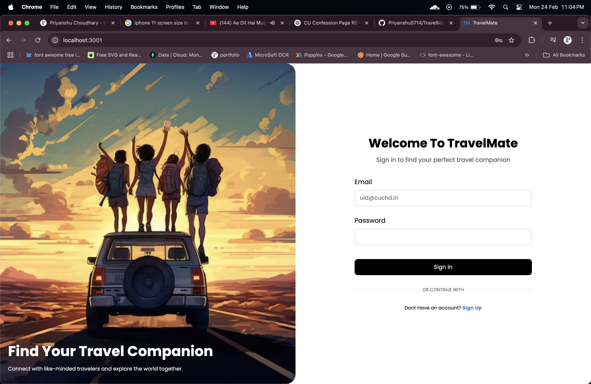
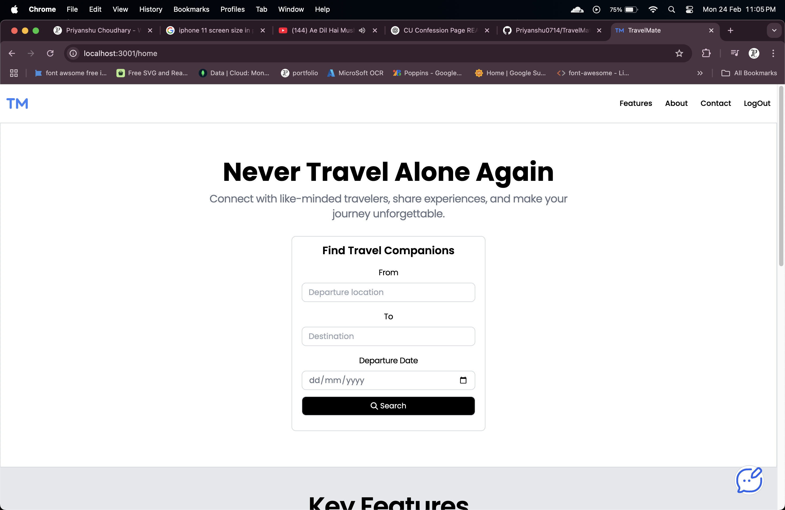
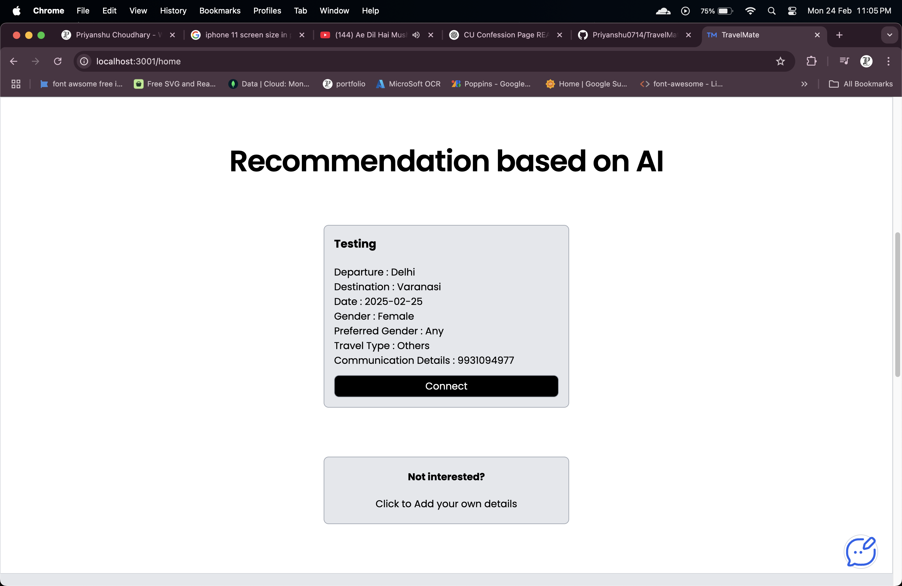

# 🌍 TravelMate

TravelMate is a web platform designed for college students to find travel partners by connecting users traveling on similar routes. Users can enter their personal and travel details, search for matches, and get AI-generated recommendations if no direct match is found.

## 📸 Preview

## 🛠️ Tech Stack

- **Frontend:**
  - `EJS` (Embedded JavaScript Templating)
  - `Tailwind CSS`
  - `JavaScript`

- **Backend:**
  - `Node.js`
  - `Express.js`

- **Database:**
  - `MongoDB`

- **AI Integration:**
  - `Llama Model API` for AI-based travel partner recommendations

## ✨ Features

- 👥 **Travel Partner Matching** – Find students traveling the same route.
- 🤖 **AI Recommendations** – Suggests nearby matches using Llama Model API when direct matches aren't found.
- 🔍 **Search & Filter** – Easily search for travel partners based on route, time, and preferences.
- 📨 **CU Email Verification** – Only allows registrations using `@cuchd.in` emails for authenticity.
- 🔒 **Secure Login & Signup** – User authentication with proper session handling.
- 📊 **Dynamic Content Display** – Real-time updates and personalized results.
- 📱 **Responsive Design** – Optimized for both desktop and mobile users.

## 🧠 Future Enhancements

- 🗺️ **Real-Time Location Sharing** *(Coming Soon)*
- 📅 **Trip History & Planner** – Keep track of past and future trips.
- 🔔 **Push Notifications** – Get alerts for new matches and trip updates.
- 📱 **Mobile App Development** – Access TravelMate on the go.
- 🧾 **Review System** – Rate and review travel partners.
- 🛡️ **Enhanced Security Features** – Multi-factor authentication and user verification.

## 🤝 Contributing

Contributions are welcome! Feel free to fork the repository, make changes, and submit a pull request.

---

**Developed with ❤️ by Priyanshu Choudhary**
